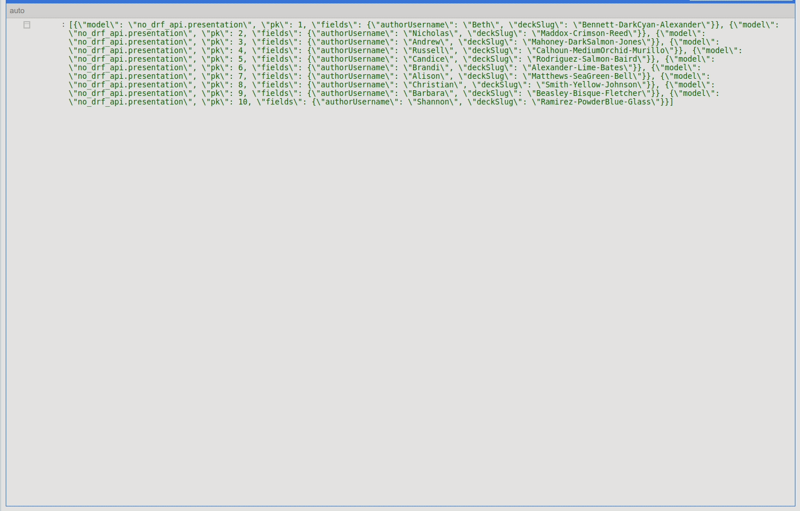

# Пробы Django REST

### Как запустить

- Скачайте код

- Установите зависимости командой `pip install -r requirements.txt`

- Выполните миграции `python3 manage.py migrate`
ps.Добавил дата-миграцию которая создает несколько "презентаций"

- Запустите сервер командой `python3 manage.py runserver`

GET - localhost:8000/api - вернет существующие презентации

POST - localhost:8000/api -в случае успеха вернет ссылку(ожидаются deckId,authorUsername,deckSlug)

